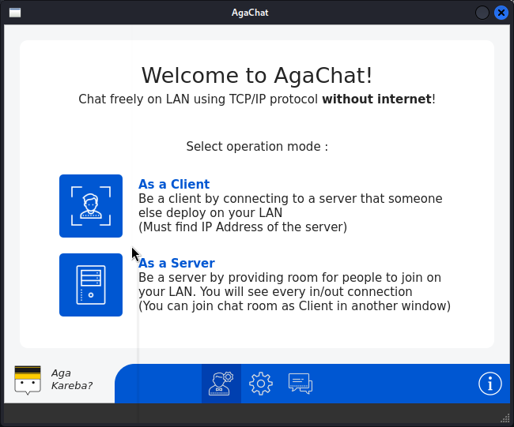
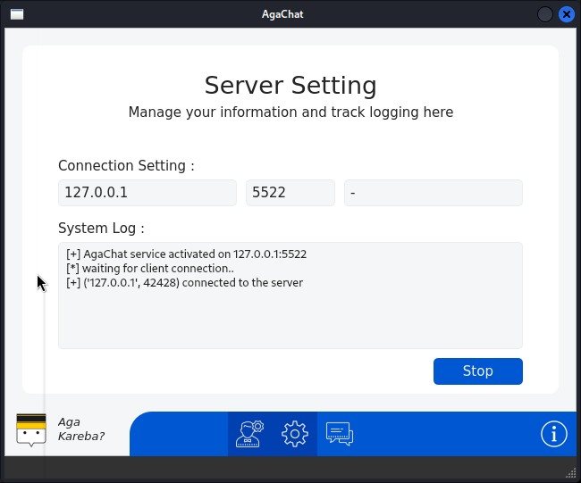
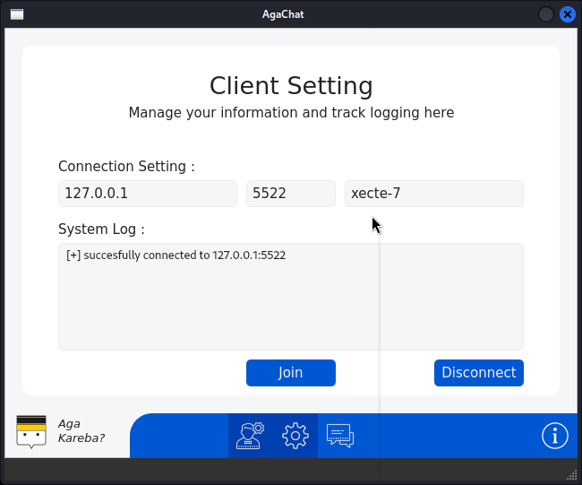
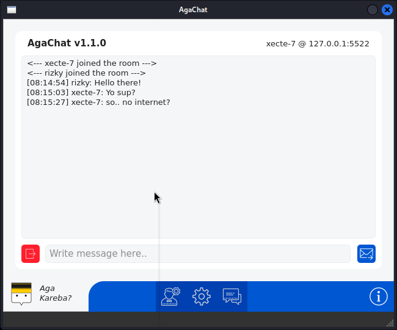
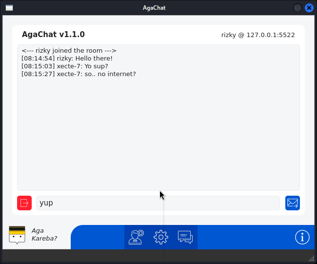

# AgaChat
### _Local Area Network Chatting App_

<p align="center" width="100%">
  <a href="https://github.com/xecte-7/AgaChat/releases">
  </a>
</p>

AgaChat is free no-internet chatting app for Local Area Network (LAN). It works by using simple TCP/IP communication. Note that both or more devices that want to communicate should be on the same network and able to ping each other.

## Installation

This project is available for listed operating system :

| Operating System | Latest version |
| ---------------- | -------------- |
| Windows | [AgaChat-1.1.0-win](https://github.com/xecte-7/AgaChat/releases/download/version-1.1.0/AgaChat-1.1.0-win.zip) |
| Linux | [AgaChat-1.1.0-linux](https://github.com/xecte-7/AgaChat/releases/download/version-1.1.0/AgaChat-1.1.0-linux.zip) |

For Linux, make sure to run the installer script so you can run it with *AgaChat* command

Install AgaChat :
```sh
chmod +x *.sh
./install.sh
```
Run AgaChat :
```sh
AgaChat
```
Uninstall AgaChat :
```sh
AgaChat-uninstall
```


## Preview







## ChangeLog

> - version 1.1.0
>   - changed project name from "WeChat" to "AgaChat"
>   - GUI mode is now available for Windows and Linux
>   - fixing bug on accepting client and disconnecting client
> 
> - version 1.0.0
>   - CLI mode and multi-platform
>   - using colored font for different client/connection

## Author

**About Me**<br>
Hello friends, I'm Muhammad Rizky (aka XECTE-7) a computer engineering college student at University of Borneo Tarakan. I started making projects on the field of ethical hacking, networking, and system utility at the beginning of 2019 till now.

**Contact**<br>
- Instagram : [@muhammad.rizky98](https://www.instagram.com/muhammad.rizky98)
- YouTube : [Portal-IT ID](https://github.com/@portal_it_id)
- Github : [@xecte-7](https://github.com/xecte-7)
- SourceForge : [@xecte-7](https://sourceforge.net/u/xecte-7)
- HackerOne : [@xecte-7](https://hackerone.com/xecte-7)

*#XECTE_7 #PORTAL_IT_ID #DariTeknikUntukDunia #HMTK_FT_UBT*